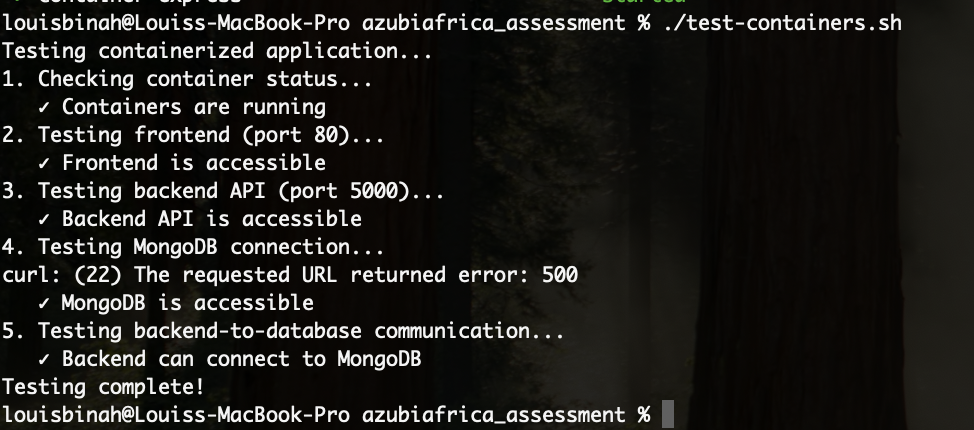

# Todo Application - Docker Setup Documentation

This document provides comprehensive instructions for setting up and running the Todo application using Docker containers. The application consists of three main components: Frontend (React/Vite), Backend (Node.js/Express), and Database (MongoDB).

## Table of Contents

- [Prerequisites](#prerequisites)
- [Project Structure](#project-structure)
- [Setup Instructions](#setup-instructions)
- [Network and Security Configurations](#network-and-security-configurations)
- [Container Testing](#container-testing)
- [Troubleshooting Guide](#troubleshooting-guide)
- [Commands Reference](#commands-reference)

## Prerequisites

Before running the application, ensure you have the following installed on your system:

- **Docker**: Version 20.10 or higher
- **Docker Compose**: Version 2.0 or higher
- **Git**: For cloning the repository (if applicable)

### Verify Installation

```bash
# Check Docker version
docker --version

# Check Docker Compose version
docker compose --version

# Use this for docker compose version 1 and update to version
docker-compose --version

# Ensure Docker daemon is running
docker info
```

## Project Structure

```
azubiafrica_assessment/
├── Frontend/
│   ├── Dockerfile
│   ├── nginx.conf
│   ├── package.json
│   ├── package-lock.json
│   └── [other frontend files]
├── Backend/
│   ├── Dockerfile
│   ├── package.json
│   ├── package-lock.json
│   ├── index.js
│   └── [other backend files]
├── docker-compose.yml
└── README.md
```

## Setup Instructions

### Step 1: Clone the repository

```bash
# If cloning from repository
git clone https://github.com/BINAH25/azubiafrica_assessment.git
cd azubiafrica_assessment

```

### Step 2: Build and Start All Services

```bash
# Build and start all containers in detached mode 
docker compose up --build -d 
```

This command will:
- Build the frontend Docker image with Vite
- Build the backend Docker image with Node.js
- Pull the MongoDB image
- Create the shared network
- Start all containers

### Step 3: Verify Services are Running

```bash
# Check all running containers
docker compose ps

# View logs from all services
docker compose logs

# View logs from specific service
docker compose logs frontend
docker compose logs backend
docker compose logs mongo
```

### Step 4: Access the Application

- **Frontend**: http://localhost (port 80)
- **Backend API**: http://localhost:5000/todos?page=1&limit=0
- **MongoDB**: localhost:27017 (accessible from host machine)

### Step 5: Stop the Application

```bash
# Stop all services
docker compose down

# Stop and remove volumes (WARNING: This will delete database data)
docker compose down -v
```

## Network and Security Configurations

### Network Architecture

The application uses a custom Docker bridge network called `shared-network` that enables secure communication between containers:

```yaml
networks:
  shared-network:
    driver: bridge
```

### Port Mappings

| Service  | Container Port | Host Port | Description |
|----------|----------------|-----------|-------------|
| Frontend | 80             | 80        | Nginx web server |
| Backend  | 5000           | 5000      | Express.js API |
| MongoDB  | 27017          | 27017     | MongoDB database |

### Environment Variables

#### Backend Service
- `MONGO_URI=mongodb://mongo:27017/todo-db` - MongoDB connection string using container name
- `PORT=5000` - Backend server port

#### Frontend Build Arguments
- `VITE_BACKEND_URL=http://localhost:5000` - Backend API URL for frontend

### Security Considerations

1. **Database Access**: MongoDB is accessible only within the Docker network and from the host machine
2. **Internal Communication**: Services communicate using container names (e.g., `mongo:27017`)
3. **File Permissions**: Frontend files are served with proper permissions (755)
4. **Volume Mounting**: Backend code is mounted for development purposes

### Data Persistence

MongoDB data is persisted using a named volume:
```yaml
volumes:
  mongo-data:
```

This ensures data survives container restarts but will be lost if the volume is explicitly removed.

## Container Testing
there is a script called test-containers.sh in the root directory of this project let make it executable for the test

#### Make the script executable
```bash
chmod +x test-containers.sh 
```

#### Execute the script
```bash
./test-containers.sh  
```


## Troubleshooting Guide

### Common Issues and Solutions

#### 1. Containers Not Starting

**Problem**: Services fail to start or immediately exit.

**Solutions**:
```bash
# Check logs for specific error messages
docker compose logs [service-name]

# Rebuild containers
docker compose down
docker compose up --build -d

```

#### 2. Frontend Cannot Connect to Backend

**Problem**: Frontend shows connection errors or API calls fail.

**Solutions**:
- Verify `VITE_BACKEND_URL` is correctly set in docker-compose.yml
- Ensure backend container is running: `docker compose ps`
- Check backend logs: `docker compose logs backend`
- Test backend directly: `curl http://localhost:5000/todos?page=1&limit=0`

#### 3. Backend Cannot Connect to MongoDB

**Problem**: Database connection errors in backend logs.

**Solutions**:
```bash
# Check if MongoDB container is running
docker compose ps mongo

# Test MongoDB connectivity from backend
docker compose exec backend ping mongo

# Verify MongoDB is accepting connections
docker compose exec mongo mongosh --eval "db.adminCommand('ping')"

# Check MongoDB logs
docker compose logs mongo
```

#### 4. Permission Denied Errors

**Problem**: File permission errors when building or running containers.

**Solutions**:
```bash
# Fix file permissions
sudo chown -R $USER:$USER .

# Rebuild containers
docker compose down
docker compose up --build -d
```

#### 5. Port Already in Use

**Problem**: Cannot bind to port 80, 5000, or 27017.

**Solutions**:
```bash
# Find what's using the port
sudo lsof -i :80
sudo lsof -i :5000
sudo lsof -i :27017

# Stop conflicting services or change ports in docker-compose.yml
```

#### 6. Build Context Errors

**Problem**: Docker cannot find files during build.

**Solutions**:
- Ensure Dockerfiles are in correct directories (Frontend/, Backend/)
- Verify docker-compose.yml paths match your directory structure
- Check for .dockerignore files that might exclude necessary files

#### 7. Volume Mount Issues

**Problem**: Backend code changes not reflected or MongoDB data issues.

**Solutions**:
```bash
# For development, ensure volume mount is correct
# Check docker-compose.yml backend service volumes section

# For MongoDB data issues, recreate volume
docker compose down -v
docker compose up --build -d
```

### Performance Issues

#### Slow Build Times
```bash
# Use Docker build cache
docker compose --build --parallel

# Clean up unused images
docker system prune -a
```

#### High Memory Usage
```bash
# Monitor container resource usage
docker stats

# Limit container resources in docker-compose.yml if needed
```

### Debugging Commands

```bash
# Enter container shell for debugging
docker compose exec frontend sh
docker compose exec backend sh
docker compose exec mongo mongosh

# View real-time logs
docker compose logs -f

# Restart specific service
docker compose restart [service-name]

# Rebuild specific service
docker compose up --build -d [service-name]
```

## Commands Reference

### Basic Operations
```bash
# Start all services
docker compose up -d

# Start with rebuild
docker compose up -d --build

# Stop all services
docker compose down

# Stop and remove volumes
docker compose down -v

# View running containers
docker compose ps

# View logs
docker compose logs
docker compose logs -f [service-name]
```

### Development Commands
```bash
# Rebuild specific service
docker compose build [service-name]

# Restart specific service
docker compose restart [service-name]

# Execute command in container
docker compose exec [service-name] [command]

# Scale services (if applicable)
docker compose up -d --scale backend=2
```

### Maintenance Commands
```bash
# Remove unused containers and images
docker system prune

# Remove unused volumes
docker volume prune

# View system usage
docker system df

# Monitor resource usage
docker stats
```

---

## Support

If you encounter issues not covered in this documentation:

1. Check the application-specific logs for detailed error messages
2. Verify all prerequisites are met and properly installed
3. Ensure no other services are using the required ports
4. Try rebuilding containers with `--no-cache` flag: `docker compose --build -d --no-cache`
